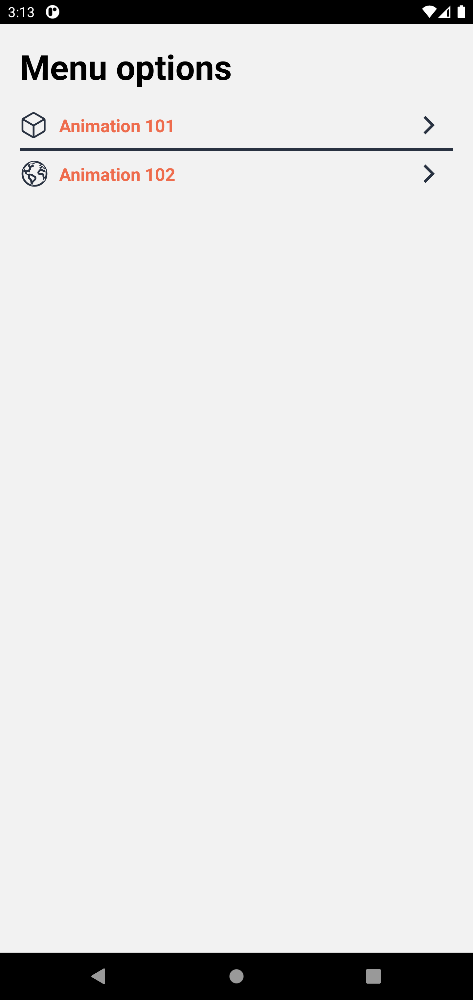
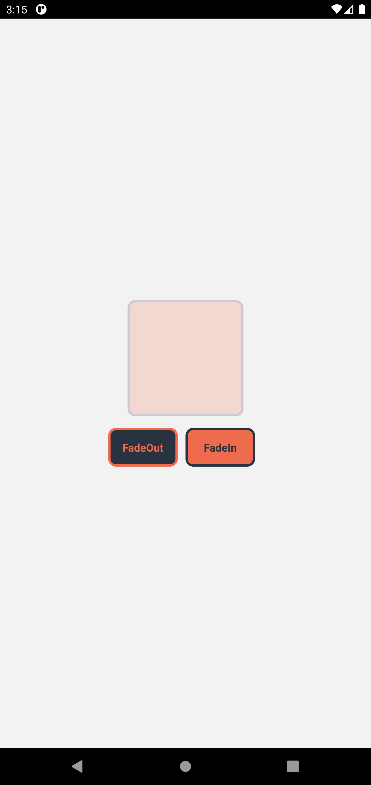
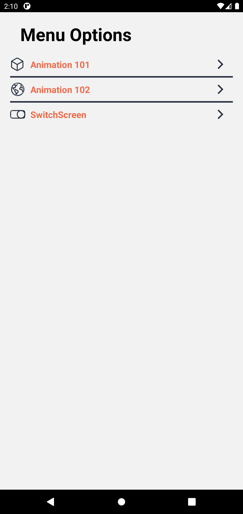

# React Native Components and Animations

## Information 🚀

_The objective of this project is to use the most important components that React Native provides us with _

### Components 📋

- FlatList
- Button
- Switch
- Section List

And more!

### Current progress 👷🏾‍♂️

